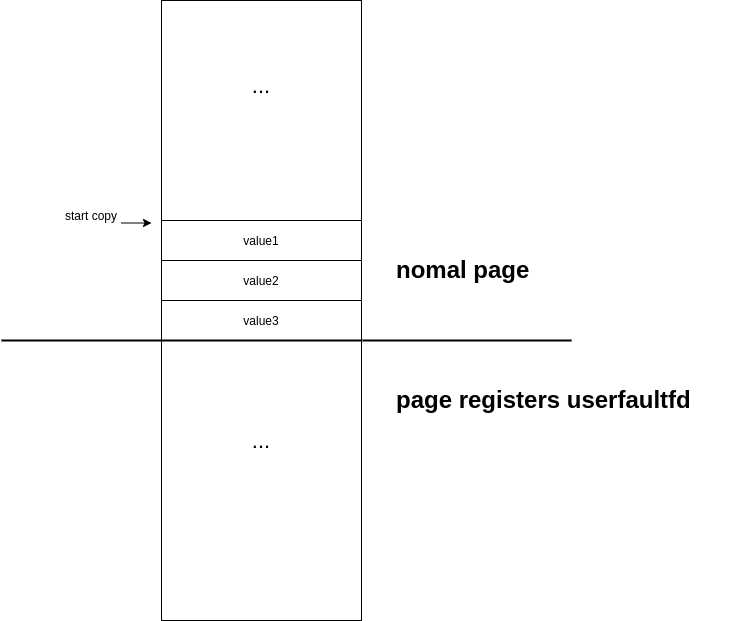
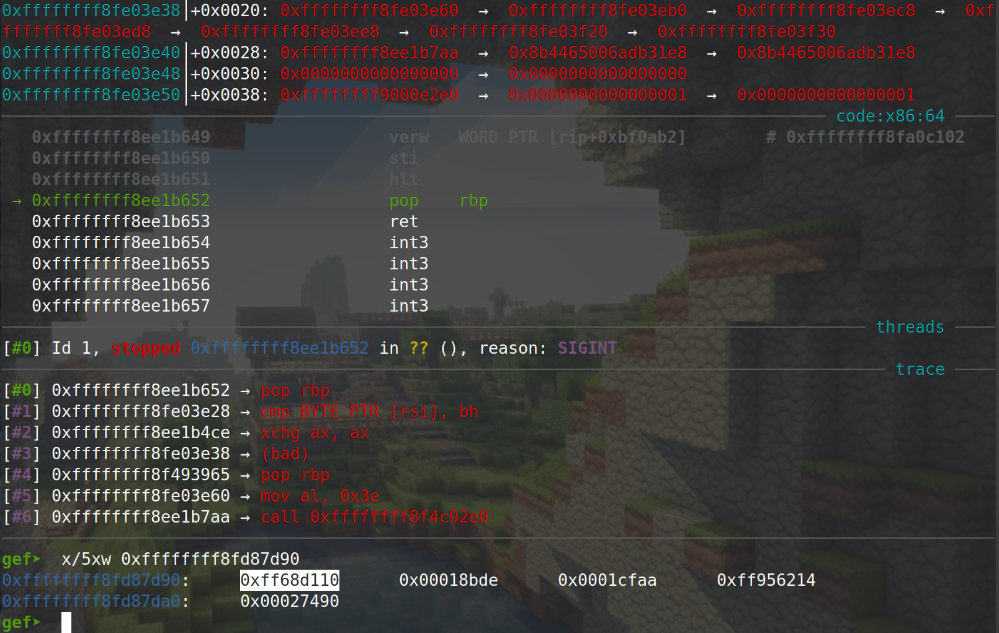

# Kernel pwn tricks & machanisms

## 1.Kernel Security Protection Mechanisms

### 1.1 Kernel ASLR


## 2.


## 2. Build a kernel for QEMU

​	There is a configuration called tinyconfig, which can build a tiny version of Linux kernel, use it like

```bash
make tinyconfig
```

​	Also, to make the kernel and debuging friendly there are some options we need to turn on


## 3.Bypass KPTI 

​	KPTI ( Kernel Page Table Isolation) is a kernel protection feature, which seperates the kernel-space page table and user space page table entirely.

​	When the kernel is running without KPTI, the procedure of ret2user is like retting to a stack with rop chain as follows

```c
    swapgs_ret    <-  esp
--------------
    iretq
--------------
 (target_rip)
--------------
   (user_cs)
--------------
 (user_rflags)
--------------
  (user_sp)
--------------
   (user_ss)
```

​	If the KPTI is enbled, ret2usr this way will resuling in a segment fault when accessing the user space code. To bypass this mechanism we choose to perform ret2usr by `swapgs_restore_regs_and_return_to_usermode`. It is a exported symbol in kernel to return to user space from kenrel space. The implementatino is like


## 4. find *modprobe_path*

​	When the compile option `CONFIG_KALLSYMS_ALL` is not turned on, which was defaut, the symble *modprob_path* is not exported to */proc/kallsyms*, making it impossible to get it by directly reading the file. We can get its address by setting a break to *call_usermodehelper_setup*.

​	The symbol *call_usermodehelper_setup* is exported to */proc/kallsyms* by default, so we can get it in most cases by reading */proc/kallsyms*. The implementation in kernel is like

```c
static int call_modprobe(char *module_name, int wait)
{
    .....
    info = call_usermodehelper_setup(modprobe_path, argv, envp, GFP_KERNEL,
					 NULL, free_modprobe_argv, NULL);
    .....
}
```

after we setting the break point we can trigger the execution like

```bash
echo -ne "\xff\xff\xff\xff\xff" > /tmp/dummy
chmod +x /tmp/dummy
/tmp/dummy
```

When the execution hit the break point the address of *modprobe_path* will be at `RDI` as the first argument of the function.

​	Refer to 

1. https://github.com/smallkirby/kernelpwn/blob/master/technique/modprobe_path.md
2. https://github.com/smallkirby/kernelpwn/blob/master/important_config/KALLSYMS_ALL.md


## 5. disable overwriting to *modprobe_path*

​	The kernel compile option `CONFIG_STATIC_USERMODEHELPER` can be tunned on to set *modprobe_path* as a static string, making it unable to be overwirten. The option is off by default however.


## 6. write kernel heap chunk with *setxattr*

​	The implementation of *setxattr* is under *fs/xattr.c* as follows

```c
static long
setxattr(struct user_namespace *mnt_userns, struct dentry *d,
	 const char __user *name, const void __user *value, size_t size,
	 int flags)
{
	.....

	if (size) {
		if (size > XATTR_SIZE_MAX)
			return -E2BIG;
		kvalue = kvmalloc(size, GFP_KERNEL);
		if (!kvalue)
			return -ENOMEM;
		if (copy_from_user(kvalue, value, size)) {
		.....
out:
	kvfree(kvalue);

	return error;
}
```

​	The function *setxattr* allocates a chunk in kernel heap according to the parameter *size* and copy user space data at **value* to it. The two parameters are fully under user's control, allowing us to allocate an arbitrary size chunk in kernel heap then write arbitrary data to it. This can be useful if we cause a double free in kernel heap and place some struct(tty_struct, cred, all kinds of vtable,...) in the chunk. We hope to get the chunk again and write data to it to overwrite some value inside the struct.

​	*setxattr* fullfills our demand. Let's say we have put a *seq_operations* struct in the double-freed chunk and we want to overwrite a function pointers in the struct. We can invoke

```c
setxattr("/dummy_file", "dummy", start_cp_addr, 0x20, XATTR_CREATE);
```

​	The *setxattr* will allocate a `0x20` chunk from the kernel heap and we can hope the chunk is the double-freed one which is now a *seq_operations* struct. Then data at *start_cp_addr* will be copied to the kernel heap chunk, overwriting the *seq_operation*.

​	The data we want to copy to the kernel chunk should have a layout like



this cause the kernel to stop execute when the copy reaches the uffd-registerd page, so the chunk allocated by *setxattr* will not be immediately freed. And if we set the handler to the uffd to a simply *hang()* the chunk will never be freed.


## 7. bypass FG-KASLR

​	KASLR allows the kernel to be loaded at a random address, while funtion and symbols in the kernel still have a fixed offset from the load base address of the kernel

​	**Function Granular ASLR**, FG-KASLR, allows each kernel funtion to be loaded at loaded at random address during the kernel boot, which means, the kernel symbols are randomized on their own and their offsets from the kernel load base address are no longer fixed.

​	Some memory regions are not affected by FG-KASLR, which means they still have a fixed offset from the load base address during two boots. To by pass FG-KASLR, we make use of these regions.

1. funtion from `_text` to `__x86_retpoline_r15`, which is `_text+0x400dc6` (in the case of kernel 5.9)
2. KPTI trampoline `swapgs_restore_regs_and_return_to_usermode()`
3. kernel symbol table `ksymtab`

​	We may find some gadgets in the region from `_text` to `_text+0x400dc6`. Generally we may look for gadgets like

```assembly
pop rax; ret
mov eax, qword ptr [rax + 0x10]; ret;
```

​	These two gadgets allows us to read arbitrary memory by setting the value of `rax`. We will read the `symtab` using the two gadgets to leak the load address of any kernel exported symbols.

​	The `symtab` stores information of each exported symbol in the form of *struct kernel_symbol*, which is defined in *include/linux/export.h*. The definition is 

```c
struct kernel_symbol {
	int value_offset;
	int name_offset;
	int namespace_offset;
};
```

or

```c
struct kernel_symbol {
	unsigned long value;
	const char *name;
	const char *namespace;
};
```

​	For the formmer one, the field *value_offset* stores the offset from the address of this kernel symbol table entry to the address of this symbol. 

​	Here is an example.


​	*commit_creds* is loaded at 0xffffffff8f414ea0.


And the entry of this symbol is loaded at 0xffffffff8fd87d90. Lets check what is store inside this entry



The *value_offset* equals 0xff68d110. A simple math

```
0xffffffff8fd87d90  +  (int)0xff68d110 = 0xffffffff8f414ea0
  entry's address         value_offset       symbol's address
```


​	This reveals that we are able to get the load address of a symbol by reading its `symtab` entry. Using the gadgets metioned above,  we store the *value_offset* to register `eax`. This is often achived by rop, thus we may return to the user land using the *swapgs* retpoline, then read `eax` immediately

```c
__asm__(
        "mov %0, rax\n"
        : "=r"(offset_value)
        :
        :"memory"
    );
```


## 8. write kernel heap chunk with *msg_msg*

​	struct *msg_msg* is a System V IPC mechanism that allow processes communicate messages with each other. It can be used to write data to kernel heap chunks allocated by *kmalloc()*, which will be useful to spray the kernel heap or write double-freed heap chunks.

​	By invoking

```c
int qid = msgget(IPC_PRIVATE, IPC_CREAT);
struct{
    long mtype;
    char mtext[MSGLEN];
}msgbuf
    
msgsnd(qid, &msgbuf, MSGLEN, 0)
```

the kernel will allocate a heap chunk of size

```c
sizeof(struct msg_msg) + MSGLEN
```

then write a `struct msg_msg` to it followed by the user data `mtext[]`. The user data is fully user controllable, allowing us to write arbitrary data to the heap chunk.

​	The struct `msg_msg` is defined in *include/linux/msg.h* as

```c
struct msg_msg {
	struct list_head m_list;
	long m_type;
	size_t m_ts;		/* message text size */
	struct msg_msgseg *next;
	void *security;
	/* the actual message follows immediately */
};
```

an invoke to *msgsnd* is forwarded to *do_msgsnd* defind in *ipc/msg.c* as

```c
static long do_msgsnd(int msqid, long mtype, void __user *mtext,
		size_t msgsz, int msgflg)
{
	struct msg_queue *msq;
	struct msg_msg *msg;
	.....

	msg = load_msg(mtext, msgsz);
	.....
}
```

 *load_msg()* invokes *kmalloc()* to get a heap chunk and copy user data to it. It is defined in *ipc/msgutil.c* as

```c
struct msg_msg *load_msg(const void __user *src, size_t len)
{
	.....
        
	msg = alloc_msg(len);
    
	....
        
	if (copy_from_user(msg + 1, src, alen))
		goto out_err;
    .....
}
```


